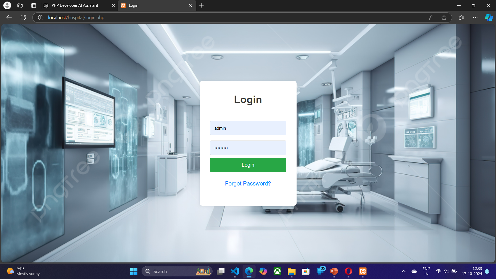
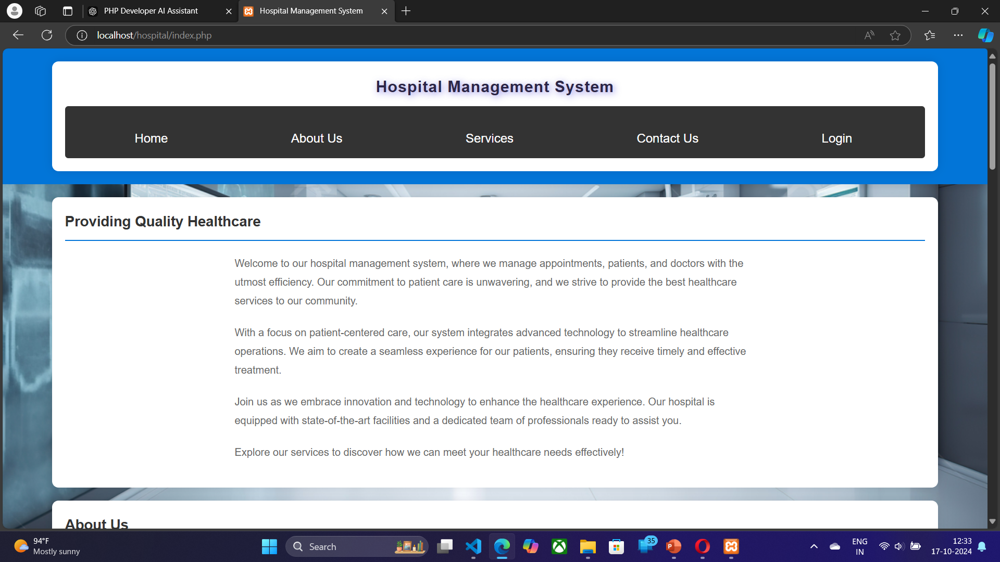
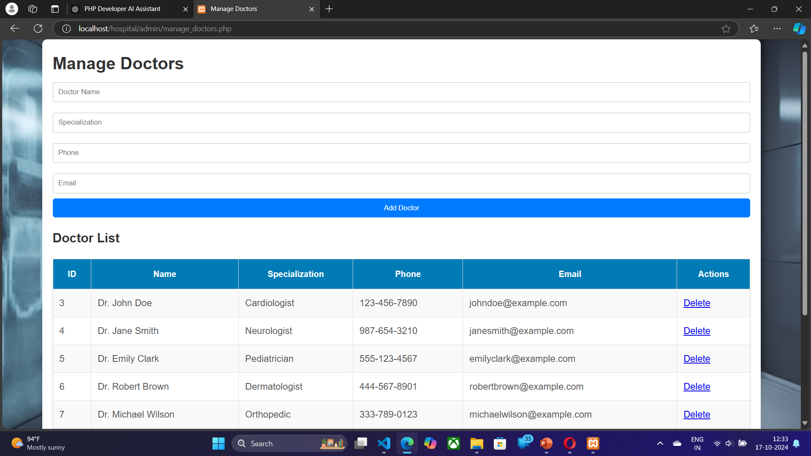
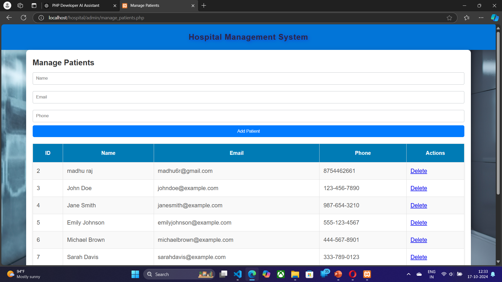
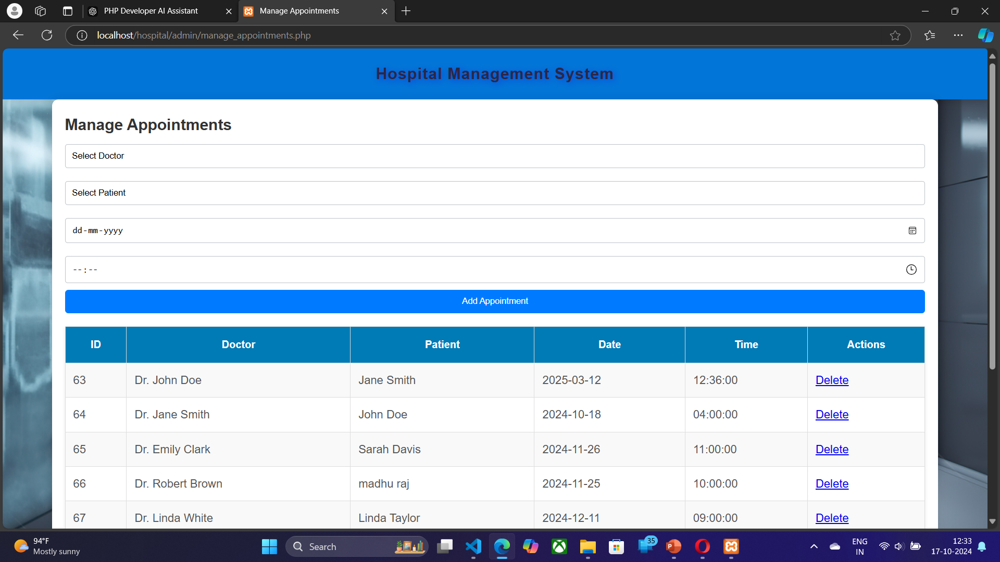
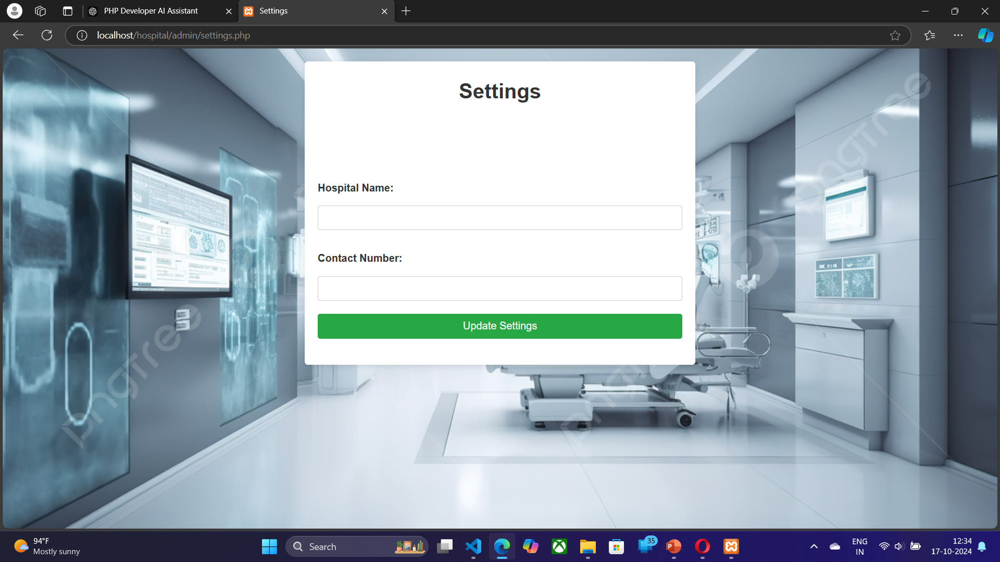
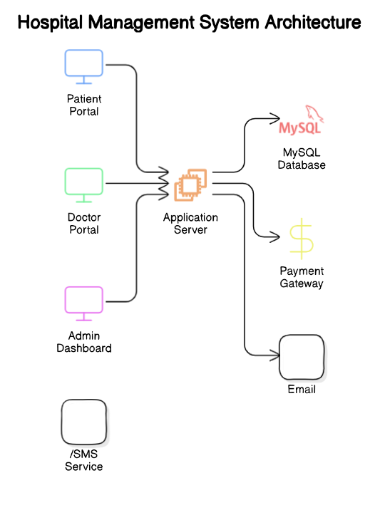

# Hospital-Management-System

Welcome to the **Hospital Management System** repository! This project is designed to streamline the management of hospital operations, including appointments, doctor-patient interactions, and administrative tasks. It's a full-featured application that enables hospitals to manage data securely and efficiently.
## Screenshots


## Screenshots

*Login*



*Admin Dashboard Overview*


*Doctor Dashboard View*



*Patient Dashboard Interface*


*Appointment Scheduling on Mobile*



*setting Overview*


## Table of Contents

- [Overview](#overview)
- [Features](#features)
- [Technologies Used](#technologies-used)
- [System Architecture](#system-architecture)
- [Database Schema](#database-schema)
- [Installation](#installation)
- [Usage](#usage)
- [Screenshots](#screenshots)
- [Future Enhancements](#future-enhancements)
- [Contributing](#contributing)
- [License](#license)

## Overview

The **Hospital Management System** is an application designed to automate hospital processes, making it easier to manage patient data, doctor schedules, appointments, billing, and more. This system aims to reduce the manual work involved in managing hospital operations and ensure data security through structured storage and access protocols.

## Features

Some of the key features of this project include:

1. **User Management**: Separate logins for doctors, patients, and administrators.
2. **Appointment Scheduling**: Patients can book appointments with available doctors, and administrators can view or modify these bookings.
3. **Doctor Management**: Manage doctor profiles, schedules, and specialization.
4. **Patient Management**: Maintain comprehensive patient records, including medical history, appointments, and billing.
5. **Billing System**: Generate and manage bills based on treatments, consultations, and other hospital services.
6. **Inventory Management**: Track inventory, including medicines, equipment, and supplies (optional).
7. **Reports**: Generate reports for appointments, billing, patient records, and inventory (optional).
8. **Notifications**: Email or SMS reminders for patients and doctors about upcoming appointments.

## Technologies Used

- **Frontend**: HTML, CSS, JavaScript
- **Backend**: PHP or Python (Django, Flask, etc. - modify based on your stack)
- **Database**: MySQL
- **Other Libraries/Frameworks**: Bootstrap (for responsive design)

## System Architecture

The system architecture is designed with a three-tier approach:

1. **Presentation Layer**: The user interface where users interact with the system (HTML, CSS, JavaScript).
2. **Application Layer**: The backend logic that handles data processing, request handling, and response generation.
3. **Database Layer**: MySQL database stores information about doctors, patients, appointments, billing, etc.

**Architecture Diagram:**

- **Database**: Handles storage of all data entities, relationships, and security constraints.
- **Backend**: API and logic layer to process requests and interact with the database.
- **Frontend**: Interface for user interaction, inputs, and visualization.



## Database Schema

### Tables:

1. **Users** - Stores login information for doctors, patients, and administrators.
2. **Doctors** - Details about each doctor (id, name, specialization, contact, availability).
3. **Patients** - Patient profiles including medical history and contact information.
4. **Appointments** - Links doctors and patients, and includes details on appointment timing and status.
5. **Billing** - Manages billing records for each patient and transaction.
6. **Inventory (optional)** - Tracks items in the hospital inventory.

### Example of `appointments` Table Schema:

| Column           | Type        | Description                          |
|------------------|-------------|--------------------------------------|
| id               | INT         | Primary key                          |
| doctor_id        | INT         | Foreign key from Doctors table       |
| patient_id       | INT         | Foreign key from Patients table      |
| appointment_date | DATE        | Date of the appointment              |
| appointment_time | TIME        | Time of the appointment              |

## Installation

Follow these steps to set up the project locally:

### Clone the Repository

1. Clone the repository to your local machine:
   ```bash
   git clone https://github.com/Sirabi08/Hospital-Management-System.git
2.Navigate into the project directory:
bash

         cd Hospital-Management-System
# Set Up Database
Create a new MySQL database.
Import the provided SQL schema file (database.sql) into your MySQL server.

        mysql -u your_username -p your_database_name < database.sql
Update the database configuration in the backend code (config.php or equivalent) with your database name, username, and password.
# Install Dependencies
If using PHP, ensure you have PHP installed and configured.
If using Python, install dependencies using:

      pip install -r requirements.txt
### Run the Application
Start the server:

       php -S localhost:8000
or for Django:

         python manage.py runserver
Visit http://localhost:8000 in your web browser.
# Usage
## Login
Admins, doctors, and patients can log in with their respective credentials.
##Admin Dashboard
Manage doctors, patients, appointments, inventory, and billing.
View reports and analytics on hospital operations.
## Doctor Dashboard
View schedules, patient details, and appointments.
Update availability and patient notes.
## Patient Dashboard
Book, view, and cancel appointments.


## Future Enhancements
Some potential future enhancements include:

Telemedicine: Integrate video call functionality for remote consultations.
Advanced Analytics: Integrate analytics to track patient flow, revenue, and treatment outcomes.
Patient Portal: Allow patients to securely view lab reports and treatment plans.
Notifications: SMS/email notifications for upcoming appointments, bills, etc.
Mobile App: Develop a mobile version for easier accessibility.
## Contributing
Contributions are welcome! Please follow these steps to contribute:

Fork the repository.
Create a new branch for your feature or bug fix.
Commit your changes and push to your branch.
Open a pull request, explaining your changes.
##  License
This project is licensed under the MIT License. See the LICENSE file for details.

